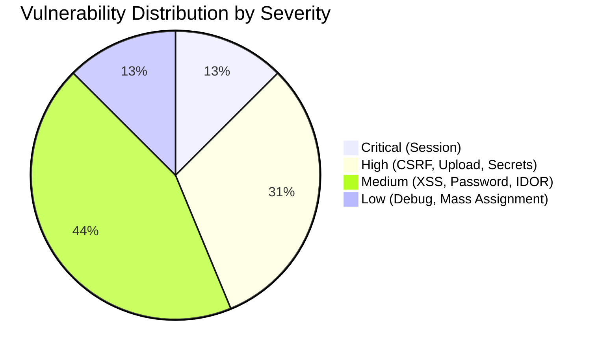

# Security Audit Report: Nutrition Tracker Application

**Audit Date:** December 22, 2024  
**Audit Type:** White-Box Security Audit  
**Auditor Role:** Senior Application Security Engineer  
**Framework:** FastAPI + Jinja2 + SQLAlchemy  

---

## Executive Summary

This security audit identified **16 significant vulnerabilities** across the Nutrition Tracker application. The most critical findings relate to **broken session management**, **missing CSRF protection**, **file upload vulnerabilities**, and **insecure access control patterns**. The application uses **bcrypt** for password hashing (which is good), but has several other security weaknesses that require immediate attention.

---

## Vulnerability Findings

| ID | Vulnerability Type | Severity | File Location & Line | Vulnerable Route | Explanation | Suggested Remediation Strategy |
|----|-------------------|----------|---------------------|------------------|-------------|-------------------------------|
| 1 | **Broken Session Management** | 🔴 **Critical** | [auth_router.py:44](file:///d:/hcmute/ITPR/nutrion_tracker/app/routers/auth_router.py#L44) | `/account/login` | Session token is a static string `"user-is-logged-in"`. User ID is stored directly in cookie without encryption or signing. An attacker can forge any user's session by simply setting `user_id` cookie to any integer. | Use cryptographically secure session tokens (JWT or signed cookies). Implement server-side session storage with secure random token IDs. |
| 2 | **Broken Session Management** | 🔴 **Critical** | [deps.py:22-23](file:///d:/hcmute/ITPR/nutrion_tracker/app/deps.py#L22-L23) | All authenticated routes | Authentication check only verifies if `session_token == "user-is-logged-in"` and trusts `user_id` cookie directly. No cryptographic verification. | Verify session tokens cryptographically. Use HMAC-signed or encrypted session data. |
| 3 | **Missing CSRF Protection** | 🔴 **High** | [admin_food_form.html:10](file:///d:/hcmute/ITPR/nutrion_tracker/app/templates/admin_food_form.html#L10) | `/admin/foods/create`, `/admin/foods/update` | All POST forms lack CSRF tokens. An attacker can craft malicious pages that submit forms on behalf of authenticated users. | Implement CSRF tokens using FastAPI-CSRF or similar. Add `` to all forms. |
| 4 | **Missing CSRF Protection** | 🔴 **High** | [admin_user_form.html:10,39](file:///d:/hcmute/ITPR/nutrion_tracker/app/templates/admin_user_form.html#L10) | `/admin/users/update`, `/admin/users/reset-password` | Admin forms for updating users and resetting passwords have no CSRF protection. This is especially dangerous for privilege escalation attacks. | Same as above. Priority for admin functions. |
| 5 | **File Upload - No Validation** | 🔴 **High** | [home_router.py:435-436](file:///d:/hcmute/ITPR/nutrion_tracker/app/routers/home_router.py#L435-L436) | `/home/profile/upload_avatar` | File upload accepts any file type without validation. No MIME type check, no file extension validation, no magic number verification. | Validate file extension against whitelist (`.jpg`, `.png`, `.gif`). Check MIME type. Verify magic bytes. Set file size limits. |
| 6 | **File Upload - No Validation** | 🔴 **High** | [camera_router.py:56-59](file:///d:/hcmute/ITPR/nutrion_tracker/app/routers/camera_router.py#L56-L59) | `/camera/result` | Image upload for food recognition has no server-side validation. While Cloudinary may have some checks, the application should validate before upload. | Same as above. Defense in depth. |
| 7 | **Hardcoded Secret Key Fallback** | 🔴 **High** | [main.py:39](file:///d:/hcmute/ITPR/nutrion_tracker/app/main.py#L39) | N/A (Configuration) | Default secret key `"your-secret-key-here-change-in-production"` is used if `SECRET_KEY` env var is missing. This is predictable and breaks session security. | Remove fallback value. Fail fast if `SECRET_KEY` is not set. Use `os.getenv("SECRET_KEY")` and raise error if None. |
| 8 | **Weak Password Policy** | 🟡 **Medium** | [auth_service.py:176-177](file:///d:/hcmute/ITPR/nutrion_tracker/app/services/auth_service.py#L176-L177) | `/home/profile/change_password` | Minimum password length is only 6 characters. No complexity requirements (uppercase, numbers, symbols). | Enforce minimum 8-12 characters with complexity requirements. Consider using a password strength library. |
| 9 | **Potential XSS - DOM Manipulation** | 🟡 **Medium** | [your_meal.html:209](file:///d:/hcmute/ITPR/nutrion_tracker/app/templates/your_meal.html#L209) | `/camera/result` | Food search results are rendered using `innerHTML` with `${food.name}` without proper escaping. If food names contain malicious scripts, they will execute. | Use `textContent` instead of `innerHTML`, or properly escape HTML entities before insertion. |
| 10 | **Potential XSS - DOM Manipulation** | 🟡 **Medium** | [your_meal.html:222](file:///d:/hcmute/ITPR/nutrion_tracker/app/templates/your_meal.html#L222) | `/camera/result` | User search query `${query}` is inserted into error message via `innerHTML` without escaping. Reflected XSS vulnerability. | Escape the query string before inserting into DOM. Use `textContent`. |
| 11 | **Information Disclosure** | 🟡 **Medium** | [auth_router.py:47-50](file:///d:/hcmute/ITPR/nutrion_tracker/app/routers/auth_router.py#L47-L50) | `/account/login` | Full exception and traceback printed to console on login error. In production with improper logging config, this may leak sensitive data. | Use proper logging with appropriate log levels. Don't print tracebacks in production. |
| 12 | **Potential IDOR** | 🟡 **Medium** | [home_router.py:310-315](file:///d:/hcmute/ITPR/nutrion_tracker/app/routers/home_router.py#L310-L315) | `/home/meals/detail?id=` | While there is a check `food_log.user_id != user.id`, ensure this pattern is consistently applied. The `id` parameter comes from query string. | Ensure all object access routes verify ownership. Consider using UUID instead of sequential IDs. |
| 13 | **Sensitive Cookie Settings Missing** | 🟡 **Medium** | [auth_router.py:44-45](file:///d:/hcmute/ITPR/nutrion_tracker/app/routers/auth_router.py#L44-L45) | `/account/login` | Cookies are set without `HttpOnly`, `Secure`, or `SameSite` attributes. Vulnerable to XSS cookie theft and CSRF. | Add `httponly=True`, `secure=True`, `samesite="Lax"` to all sensitive cookies. |
| 14 | **Supabase Keys Exposure** | 🟡 **Medium** | [auth_router.py:206-209](file:///d:/hcmute/ITPR/nutrion_tracker/app/routers/auth_router.py#L206-L209) | `/api/supabase/config` | Supabase URL and anon key are exposed via public API endpoint. While anon key is meant to be public, verify this is intentional and RLS policies are properly configured. | Ensure Supabase Row Level Security (RLS) is enabled. Review if this endpoint should be rate-limited or restricted. |
| 15 | **Mass Assignment Risk** | 🟢 **Low** | [admin_service.py:51-52](file:///d:/hcmute/ITPR/nutrion_tracker/app/services/admin_service.py#L51-L52) | `/admin/users/update` | Role is accepted from form input and validated against enum, but admin can change any user's role. Ensure only authorized admins can access this. | Add audit logging for role changes. Consider requiring additional confirmation for privilege escalation. |
| 16 | **Debug Information in Responses** | 🟢 **Low** | [camera_router.py:73-76,79](file:///d:/hcmute/ITPR/nutrion_tracker/app/routers/camera_router.py#L73-L76) | `/camera/result` | `print()` statements output debug information that may leak to logs. | Replace print statements with proper logging at DEBUG level. |

---

## Detailed Analysis by Category

### 🔐 Authentication & Session Management

The most critical vulnerability is the **broken session management system**:

```python
# auth_router.py:44-45
response.set_cookie(key="session_token", value="user-is-logged-in")
response.set_cookie(key="user_id", value=str(user.id))
```

```python
# deps.py:22-23
if not token or token != "user-is-logged-in" or not user_id:
    return None
```

**Impact:** Any attacker can impersonate any user by setting cookies:
- `session_token=user-is-logged-in`
- `user_id=1` (or any other user ID)

This completely bypasses authentication.

---

### 🛡️ CSRF Protection

**No CSRF tokens found in any forms.** All state-changing operations (POST/PUT/DELETE) are vulnerable:

- `/admin/foods/create`
- `/admin/foods/update`
- `/admin/foods/delete/{id}`
- `/admin/users/update`
- `/admin/users/reset-password`
- `/home/diary/add`
- `/home/meals/create`
- `/home/meals/update`
- `/home/profile/change_password`
- `/home/profile/upload_avatar`
- `/account/logout`

---

### 📁 File Upload Vulnerabilities

The application has two file upload endpoints with **no server-side validation**:

1. **Avatar Upload** ([home_router.py:424-441](file:///d:/hcmute/ITPR/nutrion_tracker/app/routers/home_router.py#L424-L441))
2. **Food Image Upload** ([camera_router.py:37-92](file:///d:/hcmute/ITPR/nutrion_tracker/app/routers/camera_router.py#L37-L92))

**Missing Checks:**
- ❌ File extension validation
- ❌ MIME type verification
- ❌ Magic number (file signature) check
- ❌ File size limits
- ❌ Content scanning

While files are uploaded to Cloudinary (external storage), malicious files could still be used for attacks or stored temporarily.

---

### ⚠️ Cross-Site Scripting (XSS)

**Stored/DOM-based XSS** in food search results:

```javascript
// your_meal.html:209
searchResults.innerHTML = data.results.map(food => `
    <button class="list-group-item...">
        <strong>${food.name}</strong>  // UNESCAPED
        ...
    </button>
`).join('');
```

If a food name contains `<script>alert('XSS')</script>`, it will execute.

**Reflected XSS** in search error message:

```javascript
// your_meal.html:222
<p class="small">Không tìm thấy món ăn "${query}"</p>  // UNESCAPED
```

---

### 🔑 Cryptography

**Positive Finding:** Password hashing uses **bcrypt** which is a strong algorithm:
```python
# auth_service.py:13-14
def _hash_password(self, password: str) -> str:
    return bcrypt.hashpw(password.encode('utf-8'), bcrypt.gensalt()).decode('utf-8')
```

**Negative Finding:** Weak password policy (minimum 6 characters, no complexity).

---

### 🌐 CORS & SOP

No explicit CORS configuration was found in the codebase. This is potentially secure by default (same-origin only), but should be explicitly configured for production.

---

## SQL Injection Analysis

**Good News:** The application uses SQLAlchemy ORM with parameterized queries. The FTS (Full-Text Search) queries also use parameterized queries:

```python
# food_repository.py:84-86
personal_results = self.db.execute(
    personal_query, 
    {"user_id": user_id, "query": fts_query, "limit": min(limit, 5)}
)
```

✅ **No SQL Injection vulnerabilities found.**

---

## Summary: Weakest Areas



### Priority Remediation Order

1. **🔴 CRITICAL - Fix Session Management** (IDs 1-2)
   - This is a complete authentication bypass
   - Implement proper JWT or signed session tokens

2. **🔴 HIGH - Add CSRF Protection** (IDs 3-4)
   - Add CSRF middleware and tokens to all forms
   - Especially important for admin functions

3. **🔴 HIGH - Secure File Uploads** (IDs 5-6)
   - Add file type validation before Cloudinary upload
   
4. **🔴 HIGH - Remove Hardcoded Secret** (ID 7)
   - Fail application startup if SECRET_KEY not set

5. **🟡 MEDIUM - Fix XSS Issues** (IDs 9-10)
   - Escape all user input in JavaScript templates

6. **🟡 MEDIUM - Secure Cookie Configuration** (ID 13)
   - Add HttpOnly, Secure, SameSite flags

7. **🟡 MEDIUM - Strengthen Password Policy** (ID 8)

---

## Conclusion

The Nutrition Tracker application has **critical security vulnerabilities** that must be addressed before production deployment. The session management system is fundamentally broken and allows complete authentication bypass. Combined with missing CSRF protection, an attacker could:

1. Forge any user's session
2. Access admin panel by guessing/enumerating admin user IDs
3. Modify user data, food entries, and passwords
4. Upload malicious files

**Recommended Action:** Address the Critical and High severity issues immediately before any production use.

---

*Report generated as part of Information Security course audit assignment.*
